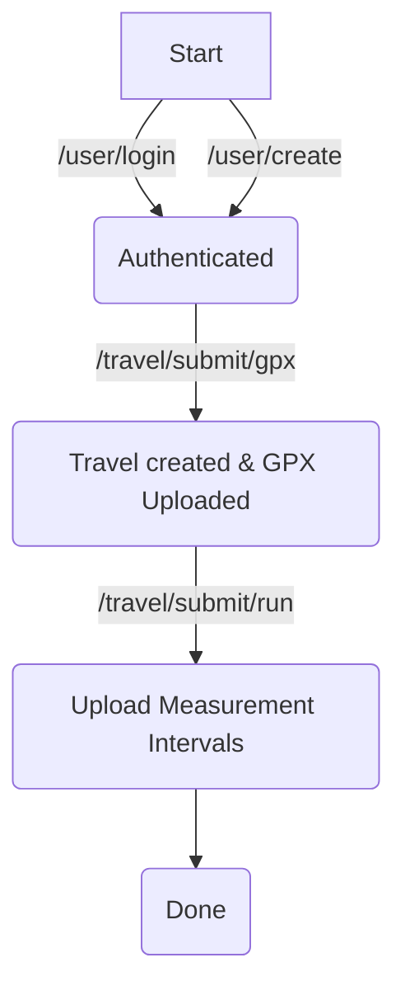

# Trekkie

[](https://builtwithnix.org)

**Contact:** <dump@dvb.solutions>

This service takes your gps tracks and times and regenerates the position mapping.

## Building

```bash
    $ nix build
```

## Usage 



