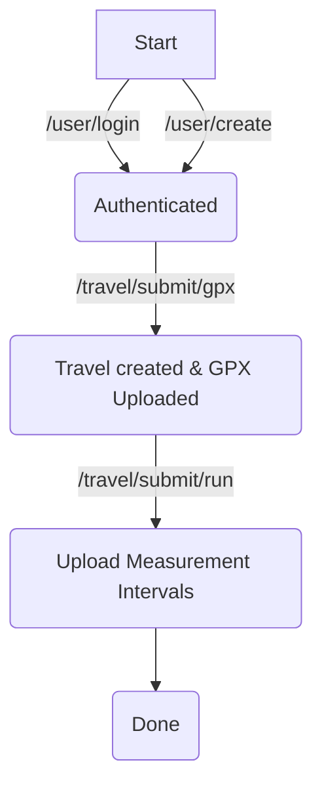

# Trekkie

[](https://builtwithnix.org)

**Contact:** <dump@dvb.solutions>

This service takes your GPS tracks and times and regenerates the position mapping.

## Usage



The `POST /user/create` endpoint will create a simple user and return the `user_id` and `password` which should be saved persistently, because they are required to authenticate against the `/user/login` endpoint.

Uploading a track is a two stage process the first is submitting the GPX file to `/travel/submit/gpx`. The second part is uploading the measurement intervals with the `/travel/submit/run` endpoint this endpoint requires the user to specify the corresponding gpx file.

### API Endpoints

For the full OpenAPI spec take a look at the `swagger.yaml` in this repository.

- **POST /user/create** creates simple trekkie user and returnes token/password back to the user
- **POST /user/login** takes the user id and password to set a authentication token
- **POST /travel/submit/gpx** takes multipart for uploading gps file this will return an id for this file
- **POST /travel/submit/run** uploads the measurement intervals with the gps file id.

## Building & Deployment

```bash
    $ nix build
```

### Environment Variables

- **REDIS_HOST**
- **REDIS_PORT**
- **GPX_PATH**
- **POSTGRES_HOST**
- **POSTGRES_PORT**

### Command Line

```
gps track collection server

Usage: trekkie [OPTIONS]

Options:
  -a, --api-host <API_HOST>  [default: 127.0.0.1]
  -p, --port <PORT>          [default: 8080]
  -s, --swagger
  -h, --help                 Print help information
  -V, --version              Print version information
```
