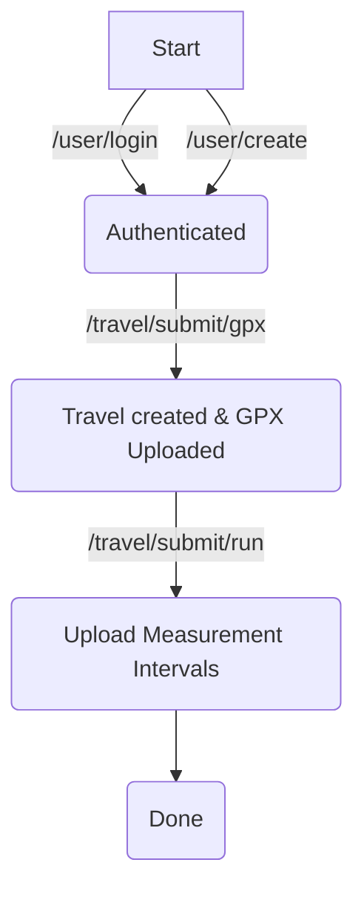

# Trekkie

[](https://builtwithnix.org)

**Contact:** <dump@dvb.solutions>

This service takes your GPS tracks and times and regenerates the position mapping.

## Building

```bash
    $ nix build
```

## Usage 



The `POST /user/create` endpoint will create a simple user and return the `user_id` and `password` which should be saved persistently, because they are required to authenticate against the `/user/login` endpoint.

Uploading a track is a two stage process the first is submitting the GPX file to `/travel/submit/gpx`. The second part is uploading the measurement intervals with the `/travel/submit/run` endpoint this endpoint requires the user to specify the corresponding gpx file.


